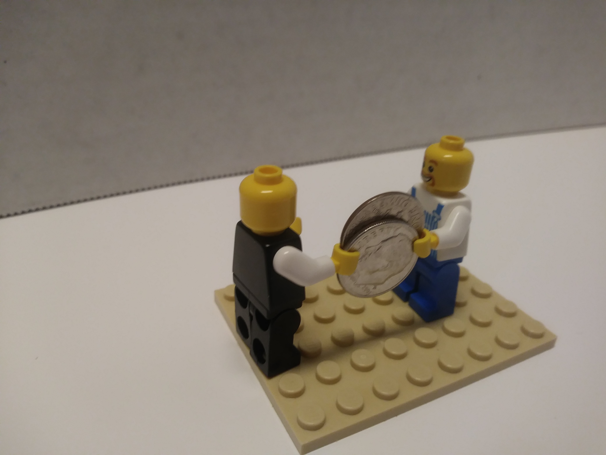
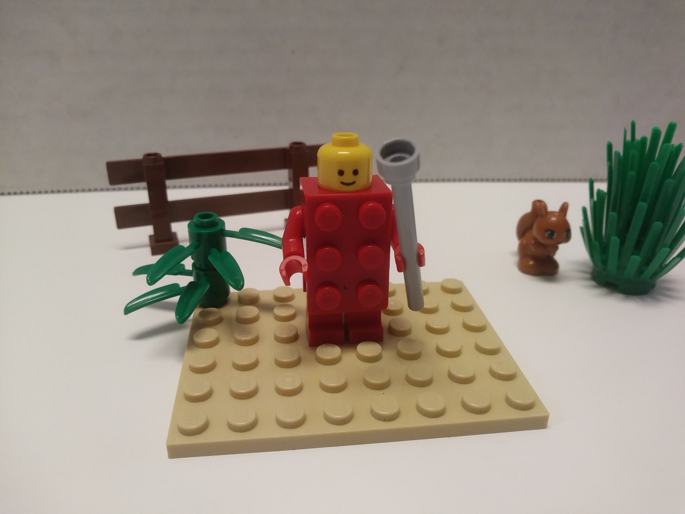
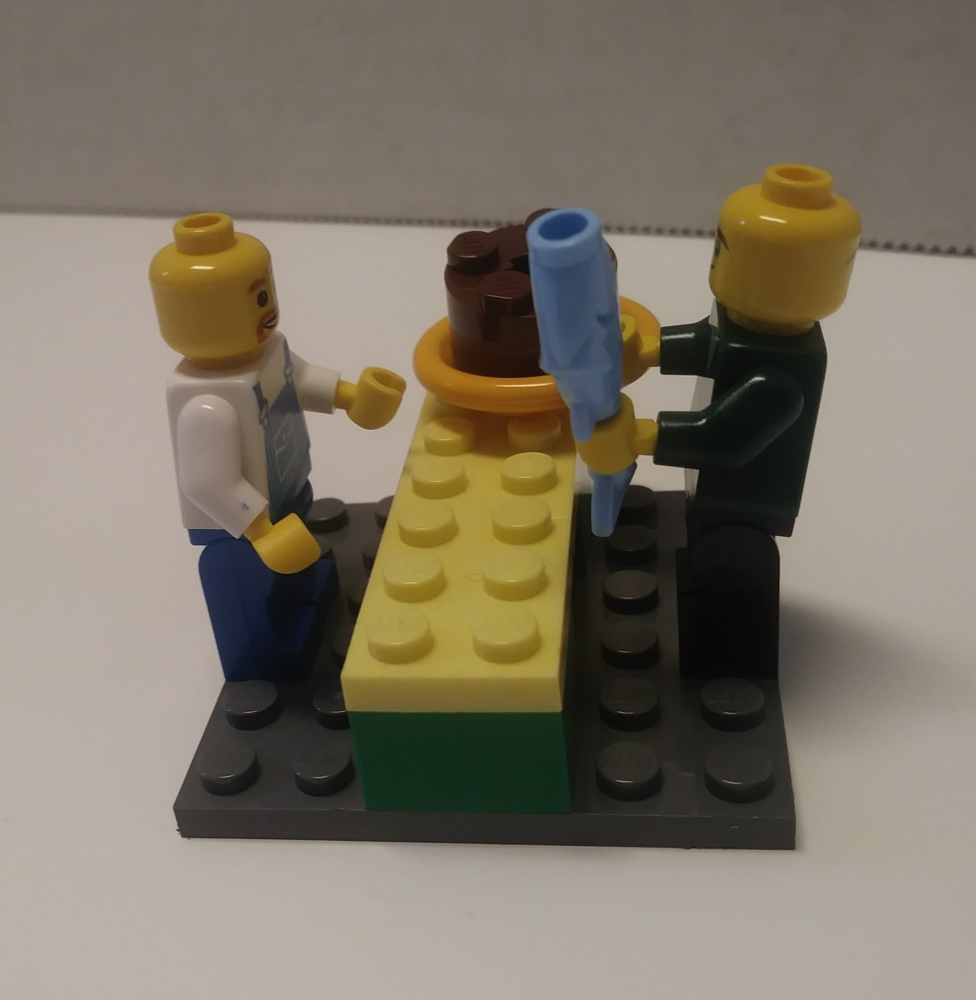
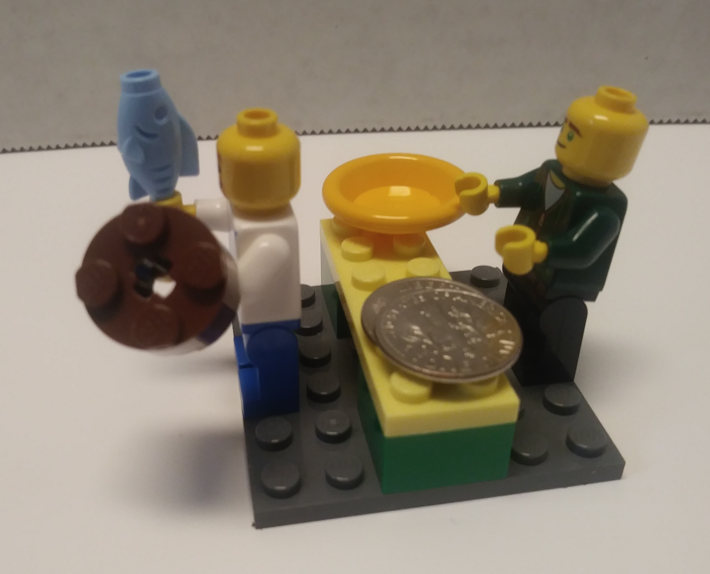

= Εις την αγοραν

<<<

(C) 2019 T. Fletcher Hardison

<<<

(1) εν μια ημερα εγένετο *δουλος* *ος* εργάζεται εν τῳ οικῳ του ανδρος.

'''

(2) ο ανηρ εστιν ο *κυριος* του δουλου.

<<<

(3) και ο κυριος έδωκεν *αργύρια* δυο προς τον δούλον αυτου και *απέστειλεν* αυτον προς την *αγόραν* του *αγοράζειν* αρτον και *ιχθυν*.

'''

(4) εν τῃ οδῳ κλεπτης ην.

 
(5) εν τῃ οδῳ, ο *απελθων* απο του οικου δουλος και *συνεβάλετο* τον *κλέπτην*

(6) και εφοβησθη ο δουλος οτι ο κλεπτης ραβδον *εσχεν*. 

(7) και ειπεν ο κλεπτης: "δος μοι τον αργύρια σου!"

(8) ο δε είπεν: "ουχι. ου *δυναμαι* τα αργύρια του κυριου μου σοι δούναι."

(9) και ελεγον *ουτως* οτι δουλος αγαθος και πιστος εστιν.

<<<

(10) τὶ εποίησεν ο δουλος; *έδραμεν* απο του κλεπτου ῆ εδωκεν τα αργύρια τῳ κλεπτῳ;

(11) έδραμεν ο δουλος απο του κλεπου.

<<<

(12) *εισερχόμενος* εις την αργοραν ο δουλος ο πιστος *εζήτησεν* τον αρτον και τον ιχθυν *ον* ηθέλησεν ο κυριος.

(13) και προσηλθεν τον αποδιδωμενον και ειπεν "θελω τον αρτον και τον ιχθυν."

(14) ο δε αποδιδωμενος ειπεν "δος μοι αργθρια δυο και τον αρτον και τον ιχθυν σοι διδωμι."

<<<

(15) και εγενετο *ως* ειπεν ο αποδιδωμενος. 

*αγοράσας* τον αρτον και τον ιχθυν ο δουλος απηλθεν απο της αγορας.

'''

(16) ου συνεβαλετο ο δουλος τον κλεπτην.

<<<

(17) εισερχομενος εις τον οικον ειπεν τῳ κυριῳ περι *τινων* *ᾶ* *συνεβη* εν τῃ οδῳ και εδωκεν τον αρτον και τον ιχθυν τῳ κυριῳ αυτου.

<<<

== Translation

. In one day, there became a slave who workes in the house of a man.
. The man is the master of the slave.
. And the master gave two sliver [coins] to his servant and sent him to the market to buy bread and fish.
. In the road there was a theif.
. In the road, the slave who came from the house also met the theif
. And the servant was afraid because the theif had a staff
. And the theif said, "Give me your sliver!"
. And he said, "No, I cannot give the sliver of my master to you."
. And he was saying thus because he was a good and faithful slave.
. What did the slave do? Did he run from the theif or give the silver to the theif?
. The slave ran from the theif.
. Coming into the market, the faithful slave sought the bread and the fish that the master wanted.
. And he approached the seller and said "I want bread and fish."
. The seller said, "Give me two sliver coins and I give you the bread and the fish."
. And it happened as the seller said.
. Having bought the bread and the fish, the slave departed from the market.
. The slave did not meet the theif.
. Coming into the house, he said [spoke] to the master about what things that had gone on in the road and he gave the bread and the fish to his master.

== Notes
. "in the road" can mean \'on the trip\'
. "there became/happend" is how Greek frequently begins a story. It's kind of like "once upon a time".
. ος, ον, ᾶ can be translated as "who" or "that". They are called "relative pronouns". The have the same gender and number as the word they refer to and their case (form) tells you what role they play in the sentence. ος and ᾶ can be subjects and ον can be an object.

