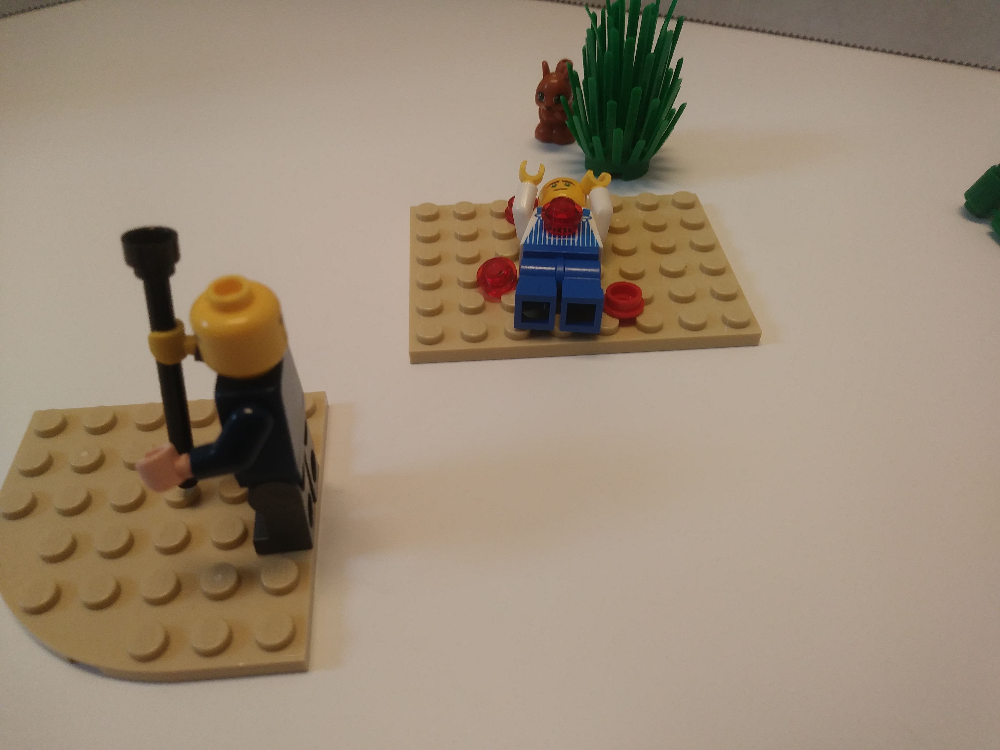
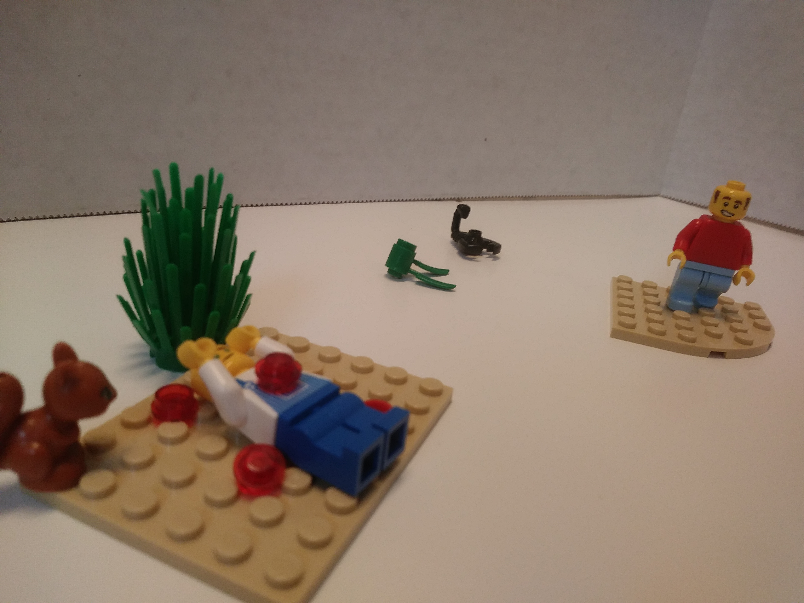
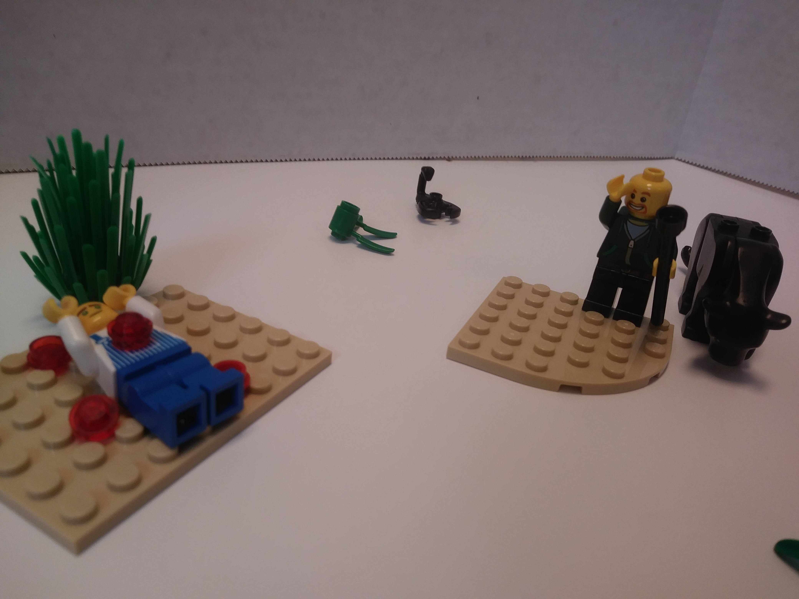
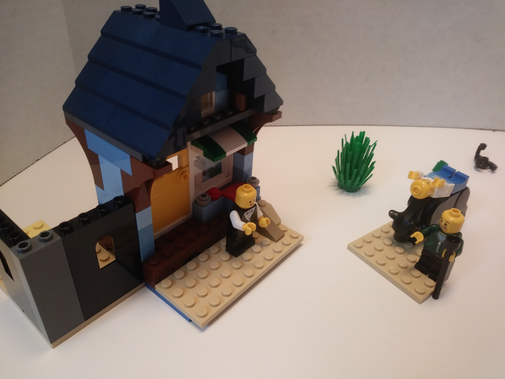
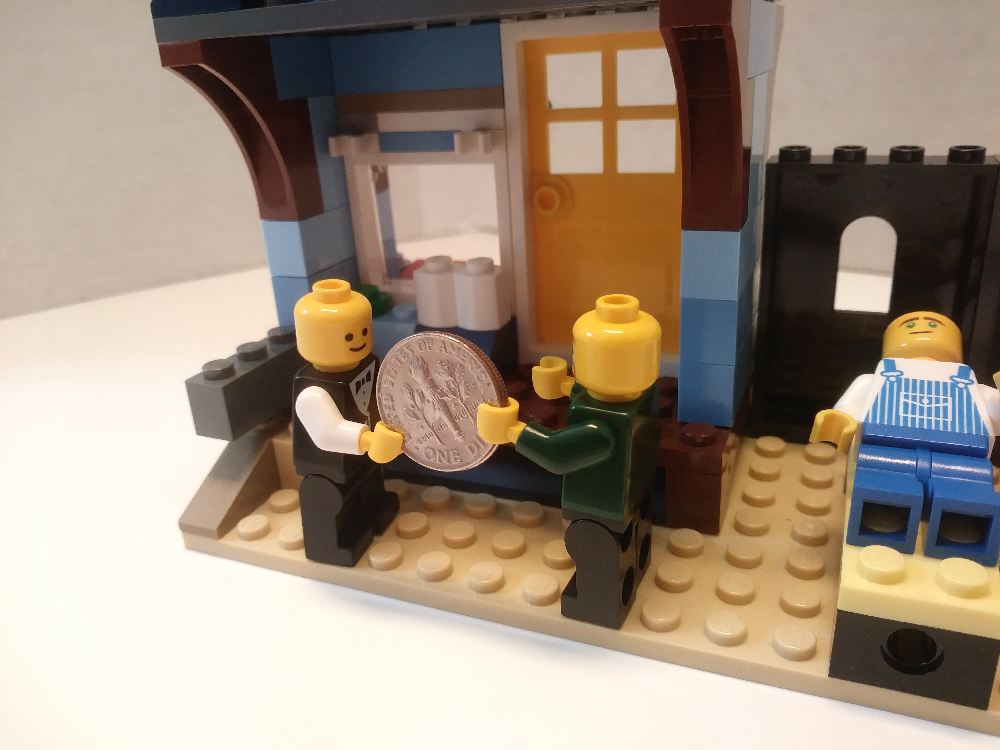
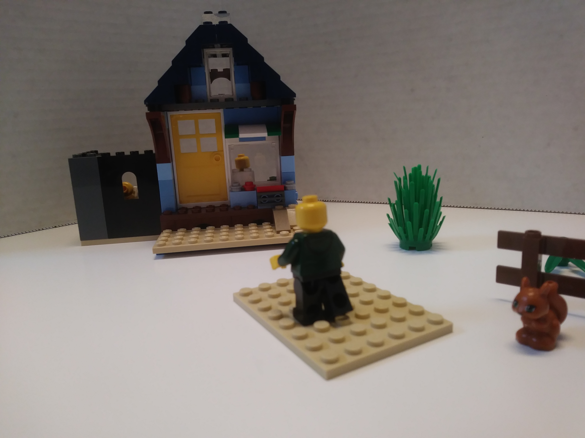

= Ο ΑΓΑΘΟΣ ΣΑΜΑΡΙΤΗΣ
:pagenums:

<<<

(C) 2019 T. Fletcher Hardison

<<<

== ΤΑ ΠΡΟΣΩΠΑ

|===
| | 
| άνθρωπος τις | ο καταβαίνων απο Ιερουσαμήμ 
| αι λῃσται | οι ανδρες οι κακοι οι επιβαλλουσιν τον άνρωπον  
| ο ιέρευς | ανηρ ος εργαζεται εν τῳ Ιερῶ εν Ιερουσαμήμ
| ο Λευίτης | ανηρ ος βοηθεῖ τον ιερέα
| ο Σαμαρίτης | ανηρ ος βοηθεῖ τον ανθρωπον ος καταβαίνων απο Ιερουσαμήμ
| ο πανδοχεύς | ανηρ ος εχει πανδοχεῖον
|===

== ΠΕΡΙ ΤΗΣ ΠΑΡΑΒΟΛΗΣ

(1) ειπεν ο Ιησους την Παραβολην ταύτην οτι ενα γραμματευς ηρώτησεν περι του εχεῖν ζωὴν αιώνιον. η οδος απο Ιερουσαλήμ εις Ιδρεχώ δι__ερχεται__ δια *ερημων* *τοπων*. ανθρωποι κακοι εθέλησαν *εκεῖ* ειναι.

<<<

image::man.jpg[align="center"]

(2) άνθρωπος τις *κατέβαινεν* απο Ιηρουσαλὴμ εις Ιεριχὼ και προς τοπον τινα ελθ__ων__ *λῃστας* συνεβάλετο.

<<<

(3) οι και τα υπαρχ__όντα__ και τα αργύρια αυτου λάβ__οντες__ και *πληγας* επιθ__έντες__ απῆλθον αφε__ντες__ αυτον ως θανατον _όντα_.

<<<

(4) εγένετο *ιέρευς* τις ος κατέβαινεν εν τῃ οδῳ εκεινῃ και *ίδ__ων__* αυτον παρ__ῆλθεν__.

<<<

(5) *ομοίως* δε και Λευίτης ελθ__ων__ προς τον τοπον και ίδ__ων__ παρῆλθεν.

<<<

(6) Σαμαρίτης δε τις ος εν τῃ οδῳ ην προσῆλθεν προς τον τοπον.

(7) ιδων τον ανθρωπον *εσπλαγχνίσθη* και *ε__βοήθη__σεν* τον πληγας __επιθέ__μενον.

<<<

(8) *επέθηκεν* δε αυτον επι τον *ονον* αυτοῦ και *ηγαγεν* αυτον εις *πανδοχεῖον*.

(9) *εκεῖ* *επεμελήθη* αυτοῦ.

<<<

(10) επι την *αύριον* εκβαλων αργύρια δυο έδωκεν τῳ πανδοχεῖ.

(11) και ειπεν, "__Επιμελήθη__τι αυτοῦ. εῖ αγοραζεις έλαιον ῆ οῖνον δια αυτον. εγω δε τα αργύρια σοι δω__σω__ επι τῳ *επιστρέφειν* με."

<<<

== Translation

.  Jesus spoke this parable because a scribe asked concerning having eternal life. The road from Jerusalem to Jericho goes through a *desolate places*. Bad men liked to be *there*.
. A certain man *was going down* from Jerusalem to Jericho and to a certain place coming, he encountered *robbers*.
. The ones both taking his possessions and money and *laying stikes* on him departed leaving him as _being_ dead.
. There was a *priest* who came down in that road and *seeing* him passed by.
. And *likewise* also a Levite coming to the palce and seeing (him) passed by.
. But a certain Samaritan who was on a journey came to the place.
. Seeing the man he *felt compassion* for him and *helped* the man who was beaten.
. He, then, *put* him *on* his *donkey* and *brought* him to an *inn*.
. There he *cared for* him.
. On the *next day*, taking out two silver coins he gave them to the *innkeeper*.
. And said, "_Care for him_. If you buy oil or wine on account of him. I will give you the money when I *return*.
